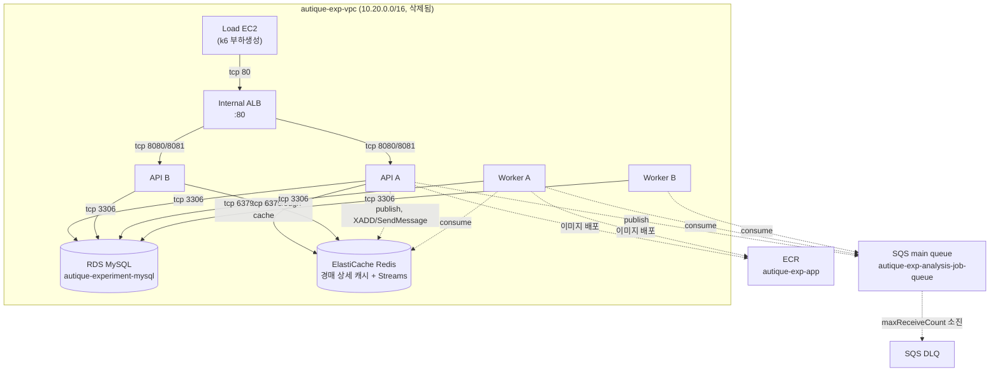
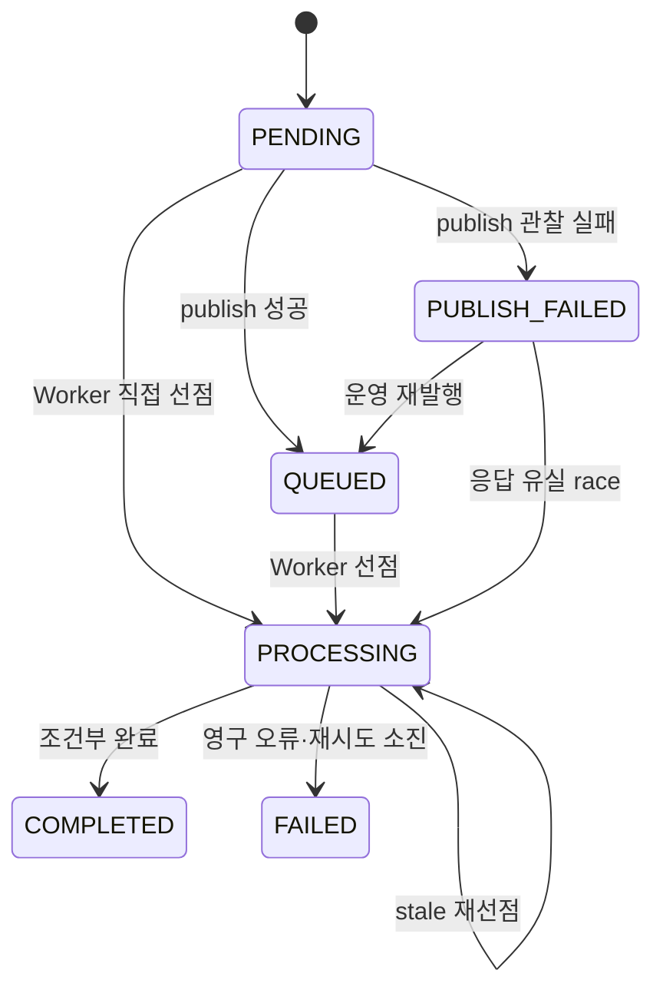
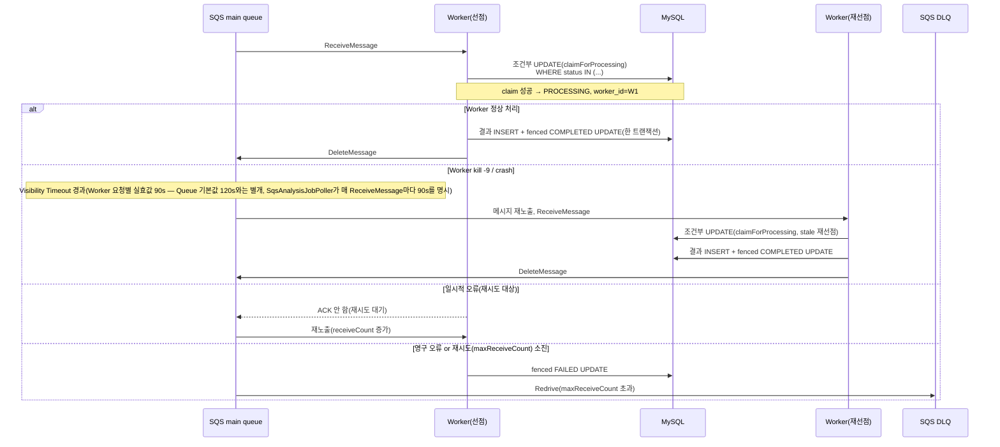
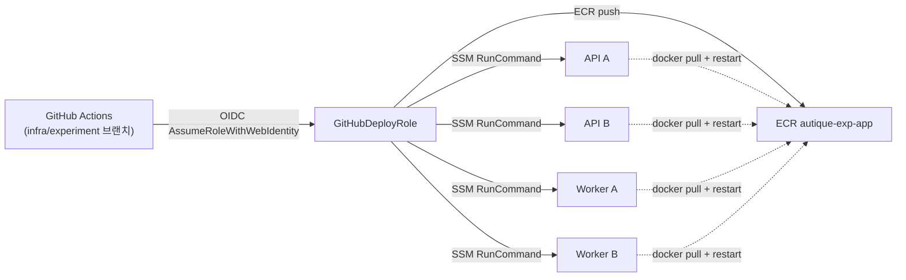

# 아키텍처와 흐름도 (Day 11~15 실험 환경)

작성 시각: 2026-09-22. 이 문서가 그리는 구조는 **Day15 cleanup 이전, 실험이 살아있던
시점**의 것이다 — 모든 AWS 자원은 현재 삭제되어 존재하지 않는다(`day15-final-report.md` §5).

## 1. 최종 실험 아키텍처

점선은 "선택적/트랙별" 경로다 — 실제로는 같은 분석 요청이 Redis Streams **또는** SQS 중 하나의
경로로만 처리된다(§7 참고, 둘 다 항상 동시에 쓰이지 않는다).

## 2. 분석 상태 전이 (contracts.md 원본, `frozen 2026-09-07`)

모든 전이는 조건부 UPDATE로 구현한다(계약, `docs/infra-sprint/contracts.md` §1). 이 상태
머신은 **SQS PoC 트랙**(`ProductAnalysisJob`)의 계약이다 — Redis Streams 경로
(`ProductAnalysisSession`)는 11개 상태(`CREATED`~`PRICING_FAILED`)의 **별도 상태 모델**을
쓰며 "조회 후 저장" 방식이다(`docs/infra-sprint/redis-streams-audit.md` §h). 두 상태 모델을
같은 것으로 혼동하지 않는다.

## 3. Worker 처리 및 재처리 흐름 (SQS 경로)

실측: kill -9 후 재선점 완료까지 **110.6초**(DB `updated_at`과 CloudWatch 완료 로그를 교차검증,
오차 84ms — `artifacts/day14/11-worker-failures-...txt`, `experiment-results.md` §1. 같은
파일에 있는 `RECOVERY_SECONDS=802`는 완료 감지에 실패한 폴링 스크립트의 버그값으로 확인돼
사용하지 않는다),
재시도 소진 시 DB FAILED(+200s)와 DLQ 도착(+297s) 사이 **97초 간극**(비원자적,
`artifacts/day14/32-b2-...txt`).

## 4. CI/CD와 배포 흐름

Day11/Day14 검증: 4개 인스턴스 전부 동일 HEAD SHA로 배포, `SHA_MATCH=4/4`,
`LKG_IS_HEAD=1`(`artifacts/day11/10-cicd-ab-same-sha-...txt`,
`artifacts/day14/30-cicd-verify-...txt`). **명시적 rollback 드릴은 이 Day11~14 범위 evidence에
없다** — 확인된 것은 "정배포 시 4개 인스턴스 SHA 일관성"이다(`experiment-results.md` §11).

## 5. Sync vs Async 구분표

| | Sync (`/api/analyses/sync`) | Async (`/api/analyses`) |
|---|---|---|
| 활성 profile | `experiment`에서만(`decisions.md`) | 전체 |
| HTTP 응답 시점 | 처리 완료까지 블로킹 | 즉시(202 Accepted) |
| 동시성 2, 실측 http_avg | 11,229ms | 57ms |
| 동시성 10, 실측 http_avg | 11,236ms | 75ms |
| 동시성 10, 실측 e2e_avg | 11,236ms(=http) | **45,279ms**(큐 대기 포함) |
| 용도 | Day13 성능 비교용 | 실제 분석 파이프라인 경로 |

(수치 출처: `experiment-results.md` §8, `artifacts/day13/11-exp1-sync-vs-async-...txt`)

## 6. API 1대 vs 2대 비교표

| 조건 | rps(VU100) | p95 latency(VU100) | API CPU% | RDS CPU max% |
|---|---:|---:|---:|---:|
| API 2대 | 688.1 | 390.8ms | A=39.1 B=39.2 | 92.4 |
| API 1대 | 488.3 | 370.4ms | A=55.0 | 71.1 |

(VU10에서는 API 1대의 RDS CPU(89.2%)가 API 2대(79.5%)보다 오히려 높음 — DB가 먼저
병목이 될 수 있음을 시사, `experiment-results.md` §9)

## 7. 컴포넌트별 책임

| 컴포넌트 | 책임 | 비고 |
|---|---|---|
| Load EC2 | k6 부하 생성 전용 | 인바운드 SG 규칙 없음(트래픽 생성만) |
| Internal ALB | API A/B 앞단 분산, health check | HTTP 80만, HTTPS 미적용(`ADR-16`) |
| API A/B | HTTP 요청 처리, Scheduler(경매 종료), 분석 요청 publish | Redis Streams **또는** SQS 중 하나로 publish |
| Worker A/B | 분석 작업 consume·처리 | Redis Streams Consumer 또는 SQS Poller 중 하나로 동작(같은 프로세스가 둘 다 하지 않음, `docs/redis-streams-recovery-audit.md` §1 "별도 개념") |
| RDS MySQL | Auction/Bid/AnalysisSession/AnalysisJob 등 모든 상태의 authoritative store | Scheduler 정합성의 최종 방어선(`ADR-10`) |
| ElastiCache Redis | (a) 경매 상세 조회 캐시(`decisions.md`: "정합성·락·큐에 사용하지 않는다"), (b) 별도로 AI 분석 파이프라인의 Streams 큐 | **(a)와 (b)는 같은 Redis지만 서로 다른 용도** — (b)는 스프린트 시작 전부터 있던 프로덕션 경로다 |
| SQS main/DLQ | 실험(PoC) 트랙의 분석 작업 큐 | Day15 cleanup으로 삭제됨 |
| ECR | 배포 이미지 저장소 | GitHub Actions가 push |

## 8. 실제 운영 도입 구조 vs 실험 전용 구조

| 구분 | 실제 운영(프로덕션) | 이번 실험 전용 |
|---|---|---|
| AI 분석 큐 | Redis Streams(`AnalysisTaskConsumer`, 기존 운영 중) | SQS(`ProductAnalysisJob`, PoC로 신규 구현, Day15 cleanup으로 AWS 자원 삭제) |
| API/Worker 배포 형태 | 별도 문서 범위(이 스프린트에서 다루지 않음) | EC2 2대(API)+2대(Worker), SSM 기반 배포 |
| 진입점 | 별도 문서 범위 | Internal ALB + HTTP(도메인/HTTPS 없음, `ADR-16`) |
| DB 동시성 전략 | **Pessimistic Lock**(`SELECT ... FOR UPDATE`, 유지 결정, `docs/experiments/concurrency/summary.md`) | No-lock/Pessimistic/Optimistic 3가지 실험적으로 비교(§1 `experiment-results.md`) |
| 인프라 코드화 | 수동 CLI(Day7) | Terraform(tf-dev, 별도 CIDR/state, `day15-final-report.md` §4) |

이 표의 "실제 운영" 열은 이번 세션에서 직접 재검증한 것이 아니라 기존 문서(`decisions.md`,
`docs/experiments/concurrency/summary.md`, `docs/ai-async-analysis.md`)에 근거해 옮겨 적은
것이다 — 실제 프로덕션 배포 상태를 이 세션에서 다시 조회하지 않았다(**미검증** 항목은 위
표 밖의 "별도 문서 범위"로 표기).
