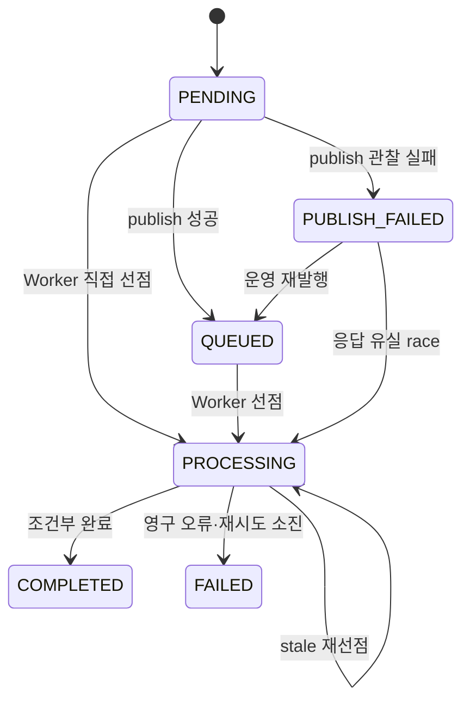

# 인프라 스프린트 공통 계약 (Frozen 2026-09-07)
이 문서의 계약은 스프린트 중 변경하지 않는다. 변경이 필요하면 ADR을 먼저 쓴다.


## 1 분석 상태



모든 상태 변경은 조건부 UPDATE로 구현한다. Java에서 `조회 → if → 저장`만으로 경쟁 조건을 막지 않는다.

응답유실 race: SQS에는 메시지가 정상 등록됐는데, API 서버가 성공 응답을 받지 못하는 상황,실제 작업은 전달됐는데 성공 응답만 사라진 경우에도 상태가 꼬이지 않게 하는 장치

## 2 API 계약

```
POST /api/uploads/presigned-url
  → 서버 생성 objectKey + 짧은 만료시간의 PUT URL

POST /api/analyses
  Header: Idempotency-Key 필수
  → 202 Accepted
  → { analysisId, status }

POST /api/analyses/sync
  → Day 13 동기 대 비동기 비교용
  → 비동기 경로와 같은 Real/Fake Processor 사용

GET /api/analyses/{analysisId}
  → 상태 + 완료 시 결과
```

Publish 최종 실패를 Producer가 확실히 관찰한 경우:

```
DB 상태: PUBLISH_FAILED
HTTP: 503 + analysisId
```

다만 Worker가 이미 `PROCESSING/COMPLETED`로 바꿨다면 `PUBLISH_FAILED` 조건부 UPDATE가 0건이므로 실제 상태를 반환한다.(API가 뒤늦게 실패 도장을 찍어도, 이미 일하고 있는 Worker의 상태를 덮어쓰지 못하게 한다.**뒤늦은 실패 처리가 정상 진행 상태를 망가뜨리지 않게 하는 장치**)

## 3 Processor 계약

```java
public interface AnalysisProcessor {
    AnalysisPayload process(AnalysisInput input);
}
```

계약:

- Processor는 계산만 한다.
- Processor는 session/result 테이블을 저장하거나 상태를 변경하지 않는다.
- Fake 구현은 처리시간과 오류를 결정적으로 주입할 수 있어야 한다.
- Real 구현은 실제 AI·가격 계산 로직을 호출한다.
- 호출자인 Worker가 `worker_id` 조건부 완료와 결과 INSERT를 한 트랜잭션으로 묶는다.

## 4 Timeout 관계

초기값이며 Day 3의 실제 AI 소량 측정 후 조정한다.

Day 4 2단계에서 `stale threshold >= Visibility Timeout`이 잘못된 관계임을 발견해 바로잡았다.
SQS Visibility는 메시지 **수신** 시점부터 시작하지만 `processing_started_at`은 그보다 뒤인
DB claim 시점에 기록된다. `stale threshold >= Visibility Timeout`이면 첫 재노출 시점의 처리
나이가 stale threshold보다 항상 짧아 stale 조건을 통과하지 못하고, 선점 실패한 delivery만
`ApproximateReceiveCount`를 계속 소모하며 stale 재선점이 실질적으로 일어나지 않는다.
`stale threshold`는 `정상 처리 최대시간`과 `Visibility Timeout` 사이여야 재노출 시점에
안전하게 stale로 판정된다.

```
Fake 처리시간(delay-ms)      11.164초
AI timeout                  60초
정상 Worker 최대 처리시간    70초
shutdown wait                75초
stale threshold              80초
SQS Visibility Timeout       90초 이상
```

항상 지켜야 하는 관계:

```
Fake 처리시간 < AI timeout < 정상 처리 최대시간 < shutdown wait < stale threshold < Visibility Timeout
docker stop timeout > 정상 처리 최대시간
```

테스트 Profile에서는 Visibility/stale 값을 약 5초 단위로 줄이되, 이 `stale < Visibility`
관계는 테스트 값에서도 반드시 유지한다 - Day 4 3단계(LocalStack 통합 검증)에서 짧은 테스트
값을 고를 때의 전제로 그대로 적용한다.