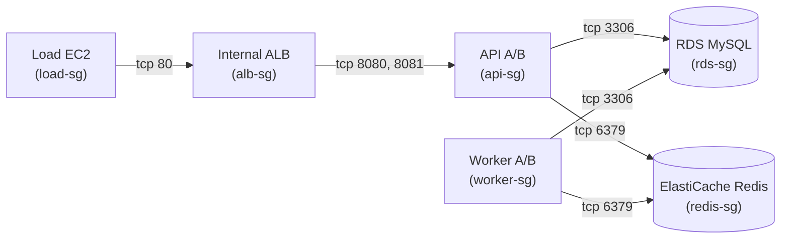

# SG / IAM 최종 상태 Matrix (실험 종료 시점, `autique-exp-vpc`)

작성 시각: 2026-09-22. 이 문서는 Day15 최종 cleanup **직전**(삭제 대상 재확인 단계)에 AWS
API로 직접 조회한 값을 기록한다 — 삭제 후에는 아래 모든 자원이 존재하지 않는다(§상태 열
참고). Secret 값(정책 JSON의 리소스 ARN 이상의 세부 조건, access key 등)은 포함하지 않는다.

## 1. Security Group 연결 관계

VPC: `vpc-0e6df568928d76b34`(`autique-exp-vpc`, `10.20.0.0/16`, 삭제됨).

| Security Group | GroupId | 인바운드 규칙 | 허용 source |
|---|---|---|---|
| `autique-exp-load-sg` | `sg-0e0b177a6bc3cc492` | 없음(인바운드 규칙 0건 — 트래픽 생성 전용, 외부에서 들어오는 연결 없음) | — |
| `autique-exp-alb-sg` | `sg-0c835b3e1af1d8bd8` | tcp 80 | `autique-exp-load-sg` |
| `autique-exp-api-sg` | `sg-0f0a074a7417679ec` | tcp 8080; tcp 8081(설명: `Internal-ALB-readiness`) | `autique-exp-alb-sg` (둘 다) |
| `autique-exp-worker-sg` | `sg-0158ea1aece418f25` | 없음(인바운드 규칙 0건 — SQS/Redis를 폴링만 함, 리스너 없음) | — |
| `autique-exp-rds-sg` | `sg-034e6f672f8a443d9` | tcp 3306 | `autique-exp-api-sg`, `autique-exp-worker-sg` (한 규칙에 2개 source) |
| `autique-exp-redis-sg` | `sg-05d4d26529d0386f7` | tcp 6379 | `autique-exp-api-sg`, `autique-exp-worker-sg` (한 규칙에 2개 source) |
| `default` | `sg-03cdd089c0ff1c17b` | 자기 자신 참조(AWS 기본 규칙) | `default`(self) — 애플리케이션이 실제로 사용하지 않음 |

모든 인바운드 규칙은 **SG-to-SG 참조 방식**이며(고정 CIDR `0.0.0.0/0` 인바운드 없음), 이는
`ADR-16`(Internal ALB + HTTP, "SG inbound는 Load SG만 공개 ingress")의 설계와 일치한다.
egress는 6개 실험 SG 전부 명시적 규칙이 조회되지 않음(AWS 기본 all-outbound로 추정,
`describe-security-groups`의 `IpPermissionsEgress`에 UserIdGroupPairs 기반 항목 없음 —
CIDR 기반 기본 egress는 이번 조회 범위에서 별도 확인하지 않음, **미검증**).

## 2. IAM Role 별 신뢰 주체·주요 권한

| Role | 신뢰 주체(Principal) | Managed Policy | Inline Policy(이름만, 내용 미검증) | Instance Profile | 마지막 사용 |
|---|---|---|---|---|---|
| `AutiqueExperimentApiRole` | `ec2.amazonaws.com` | `AmazonSSMManagedInstanceCore` | `AutiqueDay8AppLogs`, `AutiqueExperimentApiAccess` | `AutiqueExperimentApiProfile` | 2026-09-21T15:24:14Z |
| `AutiqueExperimentWorkerRole` | `ec2.amazonaws.com` | `AmazonSSMManagedInstanceCore` | `AutiqueDay8AppLogs`, `AutiqueExperimentWorkerAccess` | `AutiqueExperimentWorkerProfile` | 2026-09-21T15:24:21Z |
| `AutiqueExperimentLoadRole` | `ec2.amazonaws.com` | `AmazonSSMManagedInstanceCore` | `AutiqueExperimentLoadAccess` | `AutiqueExperimentLoadProfile` | 2026-09-21T15:10:31Z |
| `AutiqueExperimentDeployRole` | GitHub OIDC(federated, 아래 §3) | 없음 | `AutiqueExperimentDeployAccess` | 없음 | **없음(RoleLastUsed 비어있음 — 미사용 추정)** |
| `GitHubDeployRole` | GitHub OIDC(federated, 아래 §3) | 없음 | `GitHubDeployAccess` | 없음 | 2026-09-21T12:38:09Z |

3개 EC2 role 전부 `AmazonSSMManagedInstanceCore`를 붙여 **SSH 대신 SSM Session Manager로만**
접속하도록 설계됐다(`ADR-16` "Current Mitigation: SSH 대신 SSM"과 일치). Inline policy의
정확한 permission JSON(허용 action/resource 세부)은 이번 세션에서 이름만 확인했고 본문은
조회하지 않았다 — **미검증**.

## 3. GitHub OIDC 조건

Provider: `arn:aws:iam::<AWS_ACCOUNT_ID>:oidc-provider/token.actions.githubusercontent.com`
(**보존 대상**, 계정 공유 자원 — 삭제되지 않음).

| Role | `token.actions.githubusercontent.com:aud` | `token.actions.githubusercontent.com:sub` |
|---|---|---|
| `AutiqueExperimentDeployRole` | `sts.amazonaws.com` | `repo:hamyeon/be-ai:ref:refs/heads/infra/experiment` (단일 값) |
| `GitHubDeployRole` | `sts.amazonaws.com` | `repo:hamyeon/be-ai:ref:refs/heads/infra/experiment` **또는** `repo:hamyeon@266410928/be-ai@1300637660:ref:refs/heads/infra/experiment` (2개 값 배열) |

두 role 모두 `infra/experiment` 브랜치로 정확히 스코프돼 있다 — 다른 브랜치나 다른 저장소의
GitHub Actions 워크플로가 이 role을 assume할 수 없다. `GitHubDeployRole`의 두 번째 `sub`
값(`hamyeon@266410928/be-ai@1300637660` 형식)은 GitHub App/fork 실행 컨텍스트로 보이나
정확한 용도는 이번 세션에서 확인하지 않았다 — **미검증**.

## 4. AWS 관리형 / Service-linked (조사 범위 밖, 삭제 대상 아님)

`AWSServiceRoleForElastiCache`, `AWSServiceRoleForElasticLoadBalancing`,
`AWSServiceRoleForRDS`, `AWSServiceRoleForResourceExplorer`, `AWSServiceRoleForSupport`,
`AWSServiceRoleForTrustedAdvisor` — AWS가 자동 생성/관리, 이번 실험과 직접 관련 없음,
**보존**(삭제하지 않음, 삭제할 필요도 없음).

## 5. 실험 종료 후 삭제/보존 상태

| 자원 | 상태 |
|---|---|
| SG 6개(load/alb/api/worker/rds/redis) | **삭제됨**(Day15, VPC 해체의 일부) |
| `default` SG | **삭제됨**(VPC 삭제 시 자동 제거, 개별 삭제 아님) |
| IAM Role 5개(Api/Worker/Load/Deploy/GitHubDeployRole) | **삭제됨**(Day15, 사용자 승인 후 — `GitHubDeployRole` 포함 여부는 CI/CD 파이프라인 중단을 감수하고 명시적으로 승인됨) |
| Instance Profile 3개 | **삭제됨** |
| GitHub OIDC Provider | **보존**(계정 공유 자원) |
| AWS Service-linked Role 6개 | **보존**(AWS 관리형) |

상세 삭제 절차·검증 로그: `artifacts/day15/final-cleanup-execution.txt`,
`artifacts/day15/final-cleanup-verification.txt`. Secret 값(access key, 정책 세부 조건,
비밀번호 등)은 이 문서 어디에도 포함하지 않았다.
